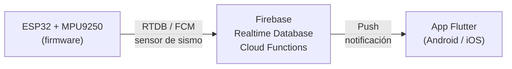

# 🌍 Sistema de Alertas Sísmicas

Sistema de alerta sísmica temprana basado en **IoT**, compuesto por un dispositivo con **ESP32** que detecta vibraciones anómalas, una base de datos en tiempo real en **Firebase**, y una **app móvil en Flutter** que recibe notificaciones push instantáneas cuando se detecta actividad sísmica.

---

## 📐 Arquitectura del sistema



1. El **ESP32** lee constantemente el acelerómetro **MPU9250** y calcula la vibración neta respecto a un ruido base calibrado al iniciar.
2. Cuando la vibración supera ciertos umbrales, clasifica el evento como **Ligero**, **Moderado** o **Fuerte**.
3. El evento se sube a **Firebase Realtime Database** y se dispara una notificación push vía **Firebase Cloud Messaging (FCM)**.
4. La **app móvil** (Flutter) recibe la alerta en tiempo real y la muestra al usuario.

---

## ✨ Funcionalidades

- 📲 Notificaciones push en tiempo real ante un evento sísmico detectado.
- 🟢🟡🔴 Clasificación de la severidad del sismo (Ligero / Moderado / Fuerte).
- 📊 Historial de eventos sísmicos sincronizado con Firebase.
- 🛰️ Estado del dispositivo (en línea / desconectado) visible desde la app.
- ⚙️ Configuración de red WiFi del ESP32 sin necesidad de reprogramarlo (modo punto de acceso).
- 🔄 Calibración automática de ruido base del sensor al encender el dispositivo.

---

## 🛠️ Tecnologías utilizadas

**App móvil**
- [Flutter](https://flutter.dev/) / Dart

**Backend / Infraestructura**
- Firebase Realtime Database
- Firebase Cloud Functions
- Firebase Cloud Messaging (FCM)

**Firmware (hardware)**
- ESP32
- Sensor acelerómetro/giroscopio MPU9250
- Comunicación WiFi (configuración mediante WiFiManager)

> ⏳ El firmware del ESP32 (`.ino`) se documentará y subirá a este repositorio próximamente, una vez confirmada la versión final utilizada en el dispositivo.

---

## 📁 Estructura del proyecto

```
Sistema_alertas_sismicas/
├── android/          # Configuración nativa Android
├── ios/              # Configuración nativa iOS
├── lib/              # Código fuente de la app Flutter
├── functions/        # Cloud Functions de Firebase
├── linux/ macos/ web/ windows/   # Soporte multiplataforma generado por Flutter
├── firebase.json     # Configuración de despliegue de Firebase
├── pubspec.yaml       # Dependencias del proyecto Flutter
└── README.md
```

---

## 🚀 Cómo ejecutar el proyecto

### Requisitos previos
- [Flutter SDK](https://docs.flutter.dev/get-started/install) instalado
- Una cuenta y proyecto de [Firebase](https://firebase.google.com/)
- Android Studio / Xcode (según la plataforma de destino)

### Pasos

1. Clona el repositorio:
   ```bash
   git clone https://github.com/jepbmx/Sistema_alertas_sismicas.git
   cd Sistema_alertas_sismicas
   ```

2. Instala las dependencias de Flutter:
   ```bash
   flutter pub get
   ```

3. Configura tu propio proyecto de Firebase:
   - Crea un proyecto en [Firebase Console](https://console.firebase.google.com/).
   - Agrega una app Android/iOS y descarga `google-services.json` (Android) o `GoogleService-Info.plist` (iOS).
   - Coloca esos archivos en `android/app/` y `ios/Runner/` respectivamente (no están incluidos en este repositorio por seguridad).

4. Ejecuta la app:
   ```bash
   flutter run
   ```

---

## 🗺️ Roadmap

- [x] App móvil con recepción de alertas en tiempo real
- [x] Integración con Firebase (RTDB + Cloud Functions + FCM)
- [ ] Subir firmware del ESP32 (en revisión)
- [ ] Historial visual de eventos sísmicos en la app
- [ ] Documentación del circuito / esquema de hardware

---

## 👤 Autor

Desarrollado por [**jepbmx**](https://github.com/jepbmx)
